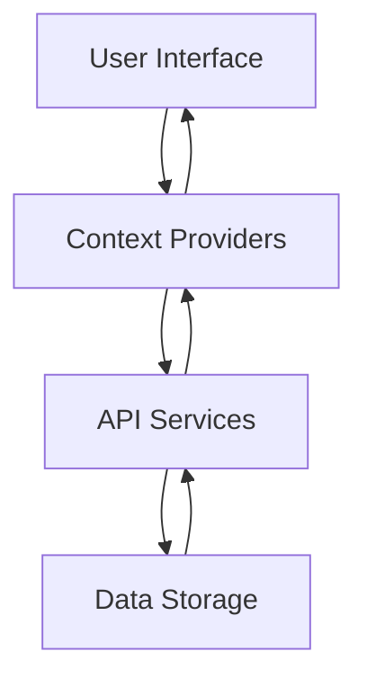

# FaultMaster Technical Documentation

## Table of Contents
1. [System Architecture](#system-architecture)
2. [Data Models](#data-models)
3. [API Documentation](#api-documentation)
4. [Security Implementation](#security-implementation)
5. [Performance Optimization](#performance-optimization)
6. [Deployment Guide](#deployment-guide)

## System Architecture

### Frontend Architecture
```typescript
// Core Technologies
- React 18.x
- TypeScript 4.x
- Tailwind CSS 3.x
- Shadcn UI Components

// State Management
- React Context API
- Custom Hooks
- Local Storage

// Key Components
- Layout
- Navigation
- Forms
- Charts
- Tables
```

### Data Flow


## Data Models

### User Model
```typescript
interface User {
  id: string;
  username: string;
  email: string;
  role: 'admin' | 'regional_manager' | 'district_engineer' | 'viewer';
  regionId?: string;
  districtId?: string;
  createdAt: Date;
  updatedAt: Date;
}
```

### Fault Models
```typescript
interface OP5Fault {
  id: string;
  regionId: string;
  districtId: string;
  faultLocation: string;
  faultType: string;
  specificFaultType: string;
  occurrenceDate: Date;
  restorationDate?: Date;
  repairDate?: Date;
  mttr?: number;
  status: 'active' | 'resolved';
  affectedPopulation: {
    rural: number;
    urban: number;
    metro: number;
  };
  reliabilityIndices: {
    saidi: number;
    saifi: number;
    caidi: number;
  };
}

interface ControlSystemOutage {
  id: string;
  regionId: string;
  districtId: string;
  outageType: string;
  specificOutageType: string;
  occurrenceDate: Date;
  restorationDate?: Date;
  customersAffected: number;
  duration: number;
  status: 'active' | 'resolved';
}
```

## API Documentation

### Authentication
```typescript
// Login
POST /api/auth/login
Request: { username: string, password: string }
Response: { token: string, user: User }

// Logout
POST /api/auth/logout
Request: { token: string }
Response: { success: boolean }
```

### Fault Management
```typescript
// Create Fault
POST /api/faults
Request: OP5Fault | ControlSystemOutage
Response: { success: boolean, fault: Fault }

// Update Fault
PUT /api/faults/:id
Request: Partial<OP5Fault> | Partial<ControlSystemOutage>
Response: { success: boolean, fault: Fault }

// Get Faults
GET /api/faults
Query: {
  regionId?: string;
  districtId?: string;
  status?: string;
  startDate?: string;
  endDate?: string;
}
Response: Fault[]
```

## Security Implementation

### Authentication
- JWT-based authentication
- Role-based access control
- Secure password storage
- Session management

### Data Protection
- Input validation
- XSS prevention
- CSRF protection
- Data encryption

### Access Control
```typescript
// Role-based permissions
const permissions = {
  admin: ['*'],
  regional_manager: ['view', 'create', 'update'],
  district_engineer: ['view', 'create'],
  viewer: ['view']
};
```

## Performance Optimization

### Frontend Optimization
- Code splitting
- Lazy loading
- Memoization
- Virtual scrolling

### Data Handling
- Pagination
- Caching
- Debouncing
- Throttling

### Best Practices
1. Use React.memo for pure components
2. Implement useCallback for event handlers
3. Use useMemo for expensive calculations
4. Implement proper error boundaries

## Deployment Guide

### Prerequisites
- Node.js 16.x or higher
- npm 7.x or higher
- Modern web browser

### Build Process
```bash
# Install dependencies
npm install

# Build for production
npm run build

# Start production server
npm run start
```

### Environment Variables
```env
VITE_API_URL=https://api.faultmaster.com
VITE_APP_NAME=FaultMaster
VITE_ENV=production
```

### Deployment Checklist
1. [ ] Run tests
2. [ ] Build application
3. [ ] Configure environment
4. [ ] Deploy to server
5. [ ] Verify deployment
6. [ ] Monitor performance

## Maintenance

### Regular Tasks
1. Update dependencies
2. Backup data
3. Monitor performance
4. Review logs
5. Apply security patches

### Troubleshooting
1. Check error logs
2. Verify database connection
3. Test API endpoints
4. Monitor system resources
5. Review user reports 